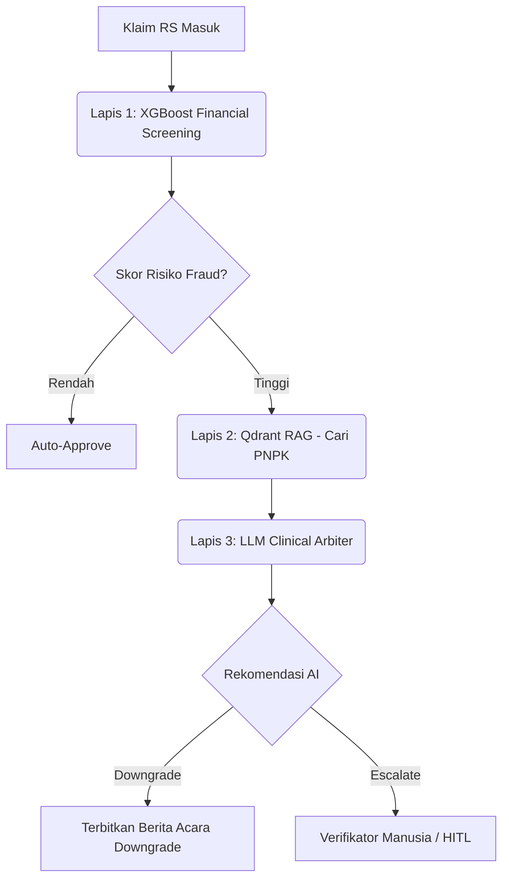

# Draf Proposal Healthkathon 2026: GARDA-JKN

## Bagian 1: Identitas & Positioning
**Nama Solusi:** GARDA-JKN (*Generative Agent for Risk Detection and Adjudication*)
**Tagline:** Mesin Penalaran Klinis untuk Adjudikasi Klaim BPJS yang Cerdas, Transparan, dan Terpercaya.
**Kategori Utama:** Efisiensi Risiko pada Fasilitas Kesehatan
**Sub-Kategori Fokus:** Manipulasi diagnosis/tindakan (*Upcoding*), *Phantom Billing*, dan Readmisi.

**Positioning Unik:**
Tidak seperti sistem deteksi *fraud* tradisional yang berupa "Blackbox AI", GARDA-JKN mengombinasikan *Explainable AI* (XGBoost + SHAP) dengan kecerdasan generatif LLM (*LangGraph* & RAG) untuk tidak hanya mendeteksi anomali finansial, tetapi juga memberikan **alasan klinis berstandar medis (PNPK)**, sekaligus menempatkan manusia sebagai penentu akhir (*Human-in-the-Loop*).

---

## Bagian 2: Masalah & Urgensi
**Spesifisitas Masalah:**
Kebocoran dana Program JKN akibat *fraud* sistemik di Fasilitas Kesehatan Tingkat Lanjut (FKRTL). Modus utama mencakup **Upcoding** (manipulasi tingkat *severity* INA-CBG agar tarif lebih mahal), **Phantom Billing** (klaim pasien/tindakan fiktif), dan **Readmisi** (pemecahan episode rawat inap).

**Dukungan Data & Urgensi:**
- **Kerugian Finansial:** Berdasarkan tinjauan KPK dan Kementerian Kesehatan (2024), estimasi kebocoran dana JKN mencapai 5-10% dari total beban klaim, atau setara dengan **Rp10 hingga Rp15 Triliun per tahun**. Terbaru, pada Juli 2024, KPK mengonfirmasi temuan *Phantom Billing* senilai Rp35 Miliar hanya dari 3 rumah sakit sebagai fenomena "puncak gunung es".
- **Beban Kerja Ekstrem (Fatigue):** Pada tahun 2023, layanan JKN menyentuh 606,7 juta kunjungan. Verifikator medis BPJS Kesehatan dihadapkan pada **8 hingga 12 juta klaim FKRTL per bulan**. Dengan rasio ribuan klaim per verifikator dan batas waktu pencairan SLA (15 hari), verifikasi manual sangat rentan *human error* dan mustahil meneliti seluruh rekam medis pasien 100%.

Jika kecurangan berlapis ini tidak ditekan di fase *pre-payment* menggunakan sistem pendeteksi cerdas yang mampu membedah pola non-linear secara seketika (*real-time*), kebocoran anggaran JKN akan menggerus keberlanjutan jaminan kesehatan nasional bagi ratusan juta rakyat Indonesia.

---

## Bagian 3: Solusi & Keunggulan
**Ide Solusi:**
Membangun platform verifikasi klaim 3-Lapis (Microservice):
1. **Lapis 1 (XGBoost + SHAP):** Melakukan *screening* finansial berkecepatan tinggi dalam hitungan milidetik untuk menyoroti *Reason Codes* (alasan anomali).
2. **Lapis 2 (Qdrant RAG):** Mesin pencarian vektor otomatis yang membandingkan klaim dengan ratusan dokumen resmi Pedoman Nasional Pelayanan Kedokteran (PNPK). RAG kami mengimplementasikan "Advanced PDF Parsing" (PyMuPDF4LLM) untuk mengurai tabel bersarang menjadi Markdown agar LLM tidak kehilangan konteks medis.
3. **Lapis 3 (LLM Agent):** *Clinical Arbiter* yang menyintesis temuan dari Lapis 1 & 2 untuk menerbitkan rekomendasi Berita Acara (APPROVED, DOWNGRADED, ESCALATED).

**Arsitektur & Workflow Sistem:**

**Keunggulan Utama:**
- **Explainability:** Menerjemahkan skor AI menjadi *Auditor Reason Codes* yang mudah dipahami (misal: "Biaya tagih Rp 7.3 juta menyimpang secara signifikan untuk INA-CBG ini").
- **Kesesuaian Regulasi (UU PDP):** Menjalankan *Zero-Knowledge Privacy Masking* pada data identitas sebelum dikirim ke AI Lapis 3.

---

## Bagian 4: Pendekatan Teknis & Data
**Input Data:** 
Menggunakan Data Sampel BPJS Kesehatan (Tabel FKRTL dan Diagnosis Sekunder).
**Proses & Model:**
- **Semi-Supervised Labeling:** Menggunakan *Stratified Isolation Forest* untuk memberi label awal *fraud* secara otomatis (mengatasi ketiadaan data label eksplisit).
- **Klasifikasi:** *Balanced Bagging XGBoost* dengan metrik F1-Score **97.14%** pada identifikasi kelas *fraud*.
**Output & Keputusan:**
Keluaran berupa API JSON terstruktur (diakses via *Next.js VClaim Mockup UI*) yang menampilkan Status Keputusan, *Severity Level* yang direvisi, Skor Risiko, dan Alasan Adjudikasi. Keputusan akhir (apabila ragu/ESCALATED) akan diteruskan ke *dashboard Human-in-the-Loop*.

---

## Bagian 5: Tingkat Kematangan, Prototype & Pengalaman
**Tingkat Kematangan: Minimum Viable Product (MVP)**
Sistem GARDA-JKN telah melewati fase purwarupa dan kini berada di tahap MVP fungsional (*End-to-End*), yang mengintegrasikan kecerdasan buatan dengan antarmuka pengguna:

1. **Apa yang Sudah Berfungsi:**
   - **Backend (FastAPI & LangGraph):** Pipeline AI Lapis 1 (XGBoost) dan Lapis 3 (LLM) sudah selesai dilatih dan berjalan penuh merespons *request* dari sisi *client*.
   - **Frontend (Next.js):** Antarmuka visual (menyerupai SIMRS VClaim) sudah *live* dan dapat diakses. Fitur interaksi manusia (HITL) untuk *approve/reject* klaim yang ambigu (*ESCALATED*) sudah berjalan penuh.
   - **RAG (*Retrieval-Augmented Generation*):** Unit Test penarikan dokumen berhasil meraih skor 100% (Lulus Uji) dalam menemukan pedoman tata laksana klinis spesifik seperti Stroke rTPA, STEMI PCI, Ulkus Diabetes, dan deteksi Upcoding Severity Level III.

2. **Lokasi Pengujian & Validasi (Hypothesis & Design):**
   - Diuji secara tertutup (*Closed Research Environment*) menggunakan **Data Sampel Resmi BPJS Kesehatan Tahun 2024** (Tabel FKRTL dan Diagnosis Sekunder).

3. **Skala Pengujian & Hasil Terukur (Value & Implementation):**
   - **Skala Data:** 5.000 data historis klaim rawat inap.
   - **Akurasi / Dampak:** Model berhasil melabeli dan mengidentifikasi *fraud* dengan performa PR-AUC 99.5% dan F1-Score 97.14%.
   - **Waktu Proses:** Waktu inferensi per klaim (deteksi XGBoost + Analisis LLM) selesai dalam waktu rata-rata kurang dari 10 detik.

---

## Bagian 6: Rencana, Model Bisnis (VHDIC Canvas) & Kelayakan
**VHDIC Canvas (Viability, Hypothesis, Design, Implementation, Cost):**
- **Viability:** Pendapatan dari penghematan anggaran (Cost-Saving). Jika 1% kebocoran dari Rp10 Triliun bisa dicegah, BPJS hemat Rp100 Miliar/tahun.
- **Hypothesis:** Verifikator kesulitan mengecek PNPK secara manual. AI RAG akan menyelesaikan masalah ini dalam 10 detik per klaim.
- **Design:** Arsitektur Microservice (FastAPI + Next.js) dengan AI Multi-Layer.
- **Implementation:** Fase 1 (Simulasi), Fase 2 (Pilot RS Tipe A), Fase 3 (Nasional).
- **Cost:** Biaya operasional mencakup API token LLM (DeepSeek/GPT), server cloud (Railway/Render), dan Vector DB (Qdrant). ROI sangat positif karena biaya infrastruktur jauh di bawah nilai klaim fraud yang berhasil digagalkan.

---

## Bagian 7: Dampak & Nilai
**Perubahan yang Dihasilkan:**
Verifikator medis beralih dari pekerjaan klerikal (mengecek manual berkas klaim satu per satu) menjadi pekerjaan analisis tingkat tinggi.
**Cara Mengukur Dampak:**
1. *Precision/Recall*: Metrik pengujian model kami mencapai **Precision@100 = 70.0%** dan **F1-Score 97.14%**.
2. Waktu deteksi dari hitungan menit per klaim turun menjadi **kurang dari 10 detik**.
**Penerima Manfaat:** 
BPJS Kesehatan (penghematan anggaran), Rumah Sakit (proses klaim valid lebih cepat cair), Masyarakat (kepastian layanan yang bermutu tanpa ada klaim obat fiktif).

---

## Bagian 8: Risiko, Privasi & Etika
1. **Perlindungan Data Pribadi (UU PDP):** Modul *Intake Agent* (Node 1) dirancang secara spesifik untuk melakukan *masking* atau anonimisasi NIK dan Nama Pasien sebelum diteruskan ke *cloud LLM*.
2. **Mitigasi Bias:** *Stratified Isolation Forest* memastikan model dilatih secara klaster berdasarkan *Kelas Rumah Sakit* (A/B/C/D). Hal ini mencegah sistem bias atau mem-penalti RS kecil secara tidak adil.
3. **Peran Manusia (HITL):** Konsep utama kami adalah AI sebagai **Asisten**, bukan pengganti. AI hanya menyetujui klaim berisiko sangat rendah, sementara klaim dengan risiko tinggi ditahan di status *ESCALATED* agar diputus secara definitif oleh Dokter/Verifikator BPJS.

---

## Bagian 9: Profil & Pengalaman Tim
1. **[Nama Anggota 1]** - Peran: *AI/ML Engineer & Backend* 
   Fokus pada arsitektur LangGraph dan XGBoost.
2. **[Nama Anggota 2]** - Peran: *UI/UX & Frontend Engineer* 
   Fokus membangun *dashboard* VClaim Next.js.
3. **[Nama Anggota 3]** - Peran: *Domain Expert / Data Scientist*
   Menerjemahkan aturan INA-CBG dan pedoman PNPK ke sistem RAG.

*(Catatan: Silakan sesuaikan nama dan peran aktual anggota tim).*
